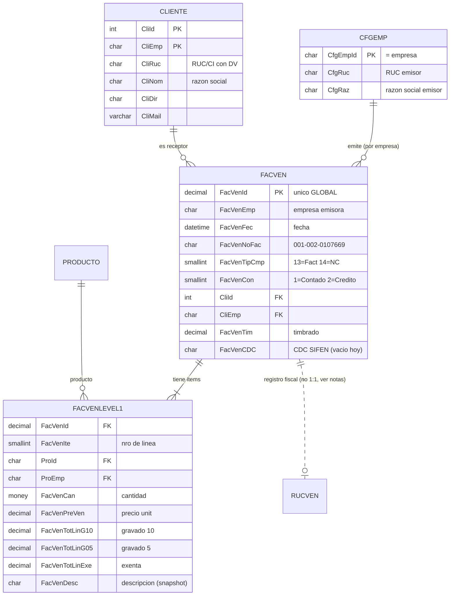

# Modelo de datos PVTA — Flujo de venta para facturación electrónica (SIFEN)

> Documento reconstruido por ingeniería inversa sobre la base `PVTA` (SQL Server 2022).
> No existía documentación previa. Todo lo aquí descrito fue **verificado contra datos reales**.
> Fecha de análisis: 2026-08-12.

---

## 1. Resumen ejecutivo

- La base es un **ERP/PDV multiempresa** paraguayo. La misma tabla contiene datos de ~15 empresas
  distintas (`HALCON26`, `IGM2026`, `4J2026`, etc.), separadas por una columna de empresa.
- **El identificador de empresa es parte de la clave** de casi todas las tablas. Ignorarlo produce
  cruces incorrectos (ver §4, hallazgo crítico).
- El núcleo de una venta son **3 tablas**:
  - `FACVEN` → cabecera de la factura de venta (110.480 filas)
  - `FACVENLEVEL1` → detalle / ítems (326.188 filas)
  - `CLIENTE` → cliente / receptor (53.805 filas)
- Los campos **SIFEN ya existen** en el esquema (`FacVenCDC`, `FacVenQR`, `FacVenTim`, `FacVenEstEnvDe`,
  `FacVenProtocolo`, `FacVenFecApro`) pero **están vacíos en el 100% de las facturas**: la facturación
  electrónica **todavía no fue activada**. Tu integración va a **escribir** esos campos, no leerlos.
- El emisor (RUC, razón social, dirección) está en `CFGEMP`, una fila por empresa.
- La base es **monomoneda**: las 110.480 ventas tienen moneda en blanco (= Guaraníes / PYG). Existen
  columnas `...ME` (moneda extranjera) pero no se usan.

---

## 2. Convención de nomenclatura (clave para leer el esquema)

| Patrón | Significado | Ejemplo |
|---|---|---|
| Prefijo por tabla | Cada tabla prefija sus columnas | `FacVen*`, `Cli*`, `Ruc Ven*`, `Cfg*` |
| Sufijo `LEVEL1` | **Tabla de detalle** (líneas) de su cabecera | `FACVEN` → `FACVENLEVEL1` |
| Sufijo `ME` / `ML` | Monto en Moneda Extranjera / Moneda Local | `FacVenTotG10ME` |
| `...Emp` | Columna de **empresa** (parte de la clave) | `CliEmp`, `ProEmp`, `SucEmp` |
| `...Id` | Identificador | `FacVenId`, `CliId`, `ProId` |
| `G10` / `G05` / `Exe` | Gravado 10% / Gravado 5% / Exenta | `FacVenTotG10` |

> Los nombres son crípticos y abreviados, pero **consistentes**. No son tablas tipo `T001`.

---

## 3. Diagrama de relaciones (tablas del flujo de venta)

**Reglas de join (verificadas):**

| Relación | Condición de join | Cardinalidad |
|---|---|---|
| Cabecera → Detalle | `FACVENLEVEL1.FacVenId = FACVEN.FacVenId` | 1 : N |
| Cabecera → Cliente | `CLIENTE.CliId = FACVEN.CliId` **AND** `CLIENTE.CliEmp = FACVEN.CliEmp` | N : 1 |
| Cabecera → Emisor | `CFGEMP.CfgEmpId = FACVEN.FacVenEmp` | N : 1 |
| Detalle → Producto | `PRODUCTO.ProId = FACVENLEVEL1.ProId` **AND** `PRODUCTO.ProEmp = FACVENLEVEL1.ProEmp` | N : 1 |

`FacVenId` es **único global** (110.480 distintos = total de filas), por eso el detalle se une solo por `FacVenId`.

---

## 4. Hallazgo crítico: `CliId` NO es único

`CliId = 10` existe en 15 empresas distintas y **apunta a personas diferentes** en cada una:

| CliEmp | CliRuc | CliNom |
|---|---|---|
| HALCON26 | 4241803-8 | ALCIDES GONZALEZ |
| IGM2026 | 5594245-8 | LIZ DENICE GONZALEZ |
| 4J2026 | 4382811-6 | JOSE CARLOS LEZCANO AGUILERA |

➡️ **Todo cruce con `CLIENTE` (y con `PRODUCTO`, `SUCURSAL`, etc.) debe incluir la columna de empresa.**
Un join solo por `CliId` mezcla clientes de distintas empresas y produciría facturas con el receptor equivocado —
inaceptable para un feed fiscal.

---

## 5. Tablas relevantes y columnas importantes

### 5.1 `FACVEN` — Cabecera de factura de venta

| Columna | Tipo | Significado |
|---|---|---|
| `FacVenId` | decimal(15) | **PK**, único global |
| `FacVenEmp` | char(8) | Empresa emisora (→ `CFGEMP`) |
| `FacVenFec` | datetime | Fecha de la venta |
| `FacVenNoFac` | char(15) | Comprobante `EST-PEXP-NUMERO` (`001-002-0107669`) |
| `FacVenTipCmp` | smallint | Tipo comprobante: **13=Factura**, **14=Nota de Crédito**, 0/3 residuales |
| `FacVenCon` | smallint | Condición: **1=Contado**, **2=Crédito**, 0 residual |
| `CliId` + `CliEmp` | int + char(8) | **Cliente (clave compuesta)** |
| `FacVenMon` | char(4) | Moneda (siempre en blanco = PYG) |
| `FacVenTim` | decimal(10) | **Timbrado** de la factura |
| `FacVenTotExe` | decimal | Total exento |
| `FAcVenTotG10` | money | Total gravado 10% (base+IVA) |
| `FacVenTotG05` | money | Total gravado 5% (base+IVA) |
| `FacVenLiqIva10` | decimal | IVA 10% liquidado |
| `FacVenLiqIva05` | decimal | IVA 5% liquidado |
| `FacVenTotImp` | decimal | **Total del comprobante** |
| `FacVenTotEfe` / `TotChe` / `TotTar` | money | Pagado en Efectivo / Cheque / Tarjeta |
| `FacVenCanCuo` | smallint | Cantidad de cuotas (si crédito) |
| `FacVenDesML` | decimal | Descuento (moneda local) |
| `FacVenAnl` | smallint | **Anulada** (0 = vigente) |
| `FacVenCajId` / `VenId` / `SucId` | char | Caja / Vendedor / Sucursal |
| `FacVenCDC` | char(50) | **CDC SIFEN** — *hoy vacío* |
| `FacVenQR` | varchar(500) | **QR SIFEN** — *hoy vacío* |
| `FacVenEstEnvDe` | smallint | **Estado de envío del DE** — *hoy null* |
| `FacVenProtocolo` / `FacVenFecApro` | numeric / datetime | Protocolo y fecha de aprobación SIFEN — *vacíos* |

### 5.2 `FACVENLEVEL1` — Detalle / ítems

| Columna | Tipo | Significado |
|---|---|---|
| `FacVenId` | decimal(15) | **FK** a cabecera |
| `FacVenIte` | smallint | Número de línea (parte de PK) |
| `ProId` + `ProEmp` | char(15)+char(8) | **Producto (clave compuesta)** |
| `FacVenCan` | money | Cantidad |
| `FacVenPreVen` | decimal(17,2) | Precio unitario |
| `FacVenTipImpVen` | smallint | Código de impuesto — **poco confiable** (=0 incluso en gravadas) |
| `FacVenTotLinExe` | decimal | Total línea exento |
| `FacVenTotLinG05` | decimal | Total línea gravado 5% |
| `FacVenTotLinG10` | decimal | Total línea gravado 10% |
| `FacVenIva10Det` / `FacVenIva05Det` | decimal | IVA de la línea (10% / 5%) |
| `FacVenDesc` | char(500) | Descripción del ítem (snapshot al momento de la venta) |

> **Determinación de la tasa por ítem:** usar **cuál de `FacVenTotLinG10/G05/Exe` está poblada**,
> NO `FacVenTipImpVen` (que vale 0 incluso en ítems gravados al 10%). Verificado en datos reales.

### 5.3 `CLIENTE` — Receptor

| Columna | Tipo | Significado |
|---|---|---|
| `CliId` + `CliEmp` | int + char(8) | **PK compuesta** |
| `CliRuc` | char(20) | RUC o CI **con dígito verificador** (`4241803-8`) |
| `CliNom` | char(150) | Razón social / nombre |
| `CliDir` | char(150) | Dirección |
| `CliMail` | varchar(500) | Email |
| `CliTel` / `CliCel` | char(40) | Teléfono / celular |
| `CliiTipIDRec` | smallint | Tipo de ID receptor SIFEN — *poblado con 0 (sin definir)* |
| `ClidNumIDRec` | char(20) | Nº ID receptor SIFEN — *vacío* |
| `CliiTiContRec` / `CliiNatRec` / `CliiTiOpe` | smallint | Tipo contribuyente / Naturaleza / Tipo operación (campos SIFEN) — *sin poblar* |
| `ClidNomFanRec` | char(200) | Nombre de fantasía receptor |

### 5.4 `CFGEMP` — Emisor (una fila por empresa)

| Columna | Tipo | Significado |
|---|---|---|
| `CfgEmpId` | char(8) | **PK** = empresa (`= FACVEN.FacVenEmp`) |
| `CfgRuc` | char(11) | **RUC del emisor** (ej. `4172191-8` = EL HALCON FERRETERIA) |
| `CfgRaz` | char(50) | Razón social |
| `CfgNomFanEmi` / `CfgNomEmi` | char(100) | Nombre de fantasía emisor |
| `CfgDir` / `CfgDir0..2` | char | Dirección |
| `CfgdNumTim` | numeric | Timbrado a nivel empresa (**=0**, usar `FacVenTim` de la factura) |
| `CfgNomRespDE` | char(250) | Responsable de Documentos Electrónicos |
| `CfgEmpTel` | char(20) | Teléfono |

### 5.5 Tablas de apoyo / catálogos

| Tabla | Filas | Rol |
|---|---|---|
| `PRODUCTO` | 78.870 | Maestro de productos (`ProId`+`ProEmp`, `ProDes`, `ProTipImpVen`) |
| `RUCVEN` | 110.136 | **Libro/registro fiscal de ventas** (ver §6) |
| `COBROFAC` | 109.068 | Cobros de facturas |
| `PEDIDO` / `PEDIDOLEVEL1` | 98k / 296k | Pedidos (previos a la venta) |
| `VENDEDOR` | 92 | Vendedores |
| `SUCURSAL` | 20 | Sucursales (`SucNom`, `SucDir`) — sin RUC propio |
| `MONEDA` | 40 | Monedas (no usado; base en PYG) |
| `COMPROBANTE` | 196 | **Config de numeración** por empresa/usuario (no es el catálogo de tipos) |
| `IVA` | 4 | Mapeo de cuentas contables de IVA (no tasas) |
| `DOCUMENTOELECTRONICO` | 32 | Config por empresa de qué tipos generan DE (no es log por factura) |
| `DETORIGEN` | 254.180 | **Trazabilidad documento→documento** a nivel ítem (ver §6.1) |

---

## 6. Sobre `RUCVEN` (leer antes de usarla)

`RUCVEN` es el **registro fiscal/libro de ventas** por comprobante. Aporta `RucVenFmaPgo` (forma de pago),
`RucVenCon`, montos por tasa y su propio `RucVenCDC`. **Pero:**

- No tiene FK a `FACVEN`. El único cruce posible es por `RucVenNoFac` + `RucVenEmp` (+ `RucVenTipCmp`).
- Ese cruce **no es 1:1**: hay hasta **2 filas** por `(NoFac, Emp, TipCmp)`.

➡️ Por eso **`RUCVEN` queda FUERA del núcleo de la vista** (uniría de más y duplicaría ventas).
La información que necesitamos (condición, forma de pago, montos por tasa) ya está en `FACVEN`.
Si más adelante hace falta algo exclusivo de `RUCVEN`, se une aparte y filtrando `RucVenAnlFac = 0`.

### 6.1 Notas de Crédito (`TipCmp = 14`) — ⚠️ requieren atención

Las NC comparten tabla (`FACVEN`/`FACVENLEVEL1`) con las facturas, pero tienen particularidades
**verificadas en datos** que afectan la integración fiscal:

- **El header de la NC está en 0**: `FacVenTotImp = 0` en 1.071 de 1.075 NC. Los importes reales
  están **solo en el detalle** (`FACVENLEVEL1`, líneas con montos positivos). ➡️ Para NC usar
  `total_items_calculado` (suma del detalle), NO `total_comprobante`. La vista ya expone ambos.
- **El vínculo NC → factura original NO está poblado de forma confiable**:
  - Las columnas `FacVenNcNoFac`, `FacVenNcNroTim`, `FacVenNcCDC`, `FacVenNCID` están vacías/0.
  - `RUCVEN` tampoco lo guarda (su fila de NC también está en 0).
  - `DETORIGEN` (tabla de trazabilidad, ver abajo) mapea `FC→NC` pero **solo 274 de 1.075 NC**;
    la mayoría no tiene enlace.

**`DETORIGEN`** es una tabla genérica de trazabilidad a nivel ítem:
`origen (DetOriOri, DetOriOriId, DetOriOriIte)` → `destino (DetOriDes, DetOriDesId, DetOriDesIte)`,
donde `Ori`/`Des` son códigos de 2 letras (`PE`=Pedido, `FV`=Factura Venta, `FC`, `NC`=Nota Crédito).
Mapeos existentes: `PE→FV` (253.906, Pedido→Factura) y `FC→NC` (274).

➡️ **SIFEN exige el documento asociado en toda NC.** Como ese vínculo está incompleto en la base,
**hay que resolverlo antes de emitir NC electrónicas** (opciones: completar el dato en el PDV,
reconstruirlo por lógica de negocio, o cargarlo manualmente). Es una decisión de negocio, no de datos.

---

## 7. Campos clave para SIFEN — mapeo

| Dato SIFEN | Origen en PVTA | Estado |
|---|---|---|
| RUC/razón social **emisor** | `CFGEMP.CfgRuc`, `CFGEMP.CfgRaz` | ✅ poblado |
| Timbrado | `FACVEN.FacVenTim` | ✅ poblado (a nivel factura) |
| Establecimiento | `LEFT(FacVenNoFac,3)` = `001` | ✅ derivable |
| Punto de expedición | `SUBSTRING(FacVenNoFac,5,3)` = `002` | ✅ derivable |
| Número de documento | `RIGHT(FacVenNoFac,7)` = `0107669` | ✅ derivable |
| Tipo de comprobante | `FacVenTipCmp` (13=Factura, 14=NC) | ✅ poblado |
| Condición de venta | `FacVenCon` (1=Contado, 2=Crédito) + `FacVenCanCuo` | ✅ poblado |
| Forma de pago | `FacVenTotEfe` / `TotChe` / `TotTar` | ✅ derivable |
| RUC/CI **receptor** | `CLIENTE.CliRuc` (incluye DV) | ✅ poblado |
| Nombre receptor | `CLIENTE.CliNom` | ✅ poblado |
| Ítems (desc, cant, precio) | `FACVENLEVEL1` | ✅ poblado |
| Tasa IVA por ítem | columna poblada `LinG10/LinG05/Exe` | ✅ derivable |
| **CDC / QR / protocolo** | `FacVenCDC` / `FacVenQR` / `FacVenProtocolo` | ⚠️ **vacíos — los generará tu integración** |

---

## 8. Supuestos y dudas a confirmar

**Supuestos hechos (verificados en datos, pero conviene ratificar):**
1. `FacVenTipCmp`: 13=Factura, 14=Nota de Crédito. Inferido por frecuencia (109.059 vs 1.075) y contexto; **no hay tabla catálogo** que lo confirme (es un enum de la aplicación).
2. `FacVenCon`: 1=Contado, 2=Crédito. Ídem, inferido por frecuencia.
3. Moneda = PYG siempre (todas en blanco).
4. Tasa por ítem se determina por la columna de total poblada, no por `FacVenTipImpVen`.

**Decisiones tomadas con el usuario (2026-08-12):**
- **RUC/CI:** la vista entrega `cliente_ruc` **crudo** (con DV). El usuario procesa la separación
  RUC/CI + DV aguas abajo.
- **Alcance:** la vista incluye **Facturas (13) + Notas de Crédito (14)** (`WHERE FacVenTipCmp IN (13,14)`).
- **La vista `VW_VENTAS_SIFEN` fue creada en la base PVTA.**

**Dudas que siguen abiertas (no asumo para un sistema fiscal):**
- **A. Vínculo NC → factura original.** Incompleto en la base (ver §6.1). SIFEN lo exige. **Bloqueante
  para emitir NC electrónicas** — requiere decisión de negocio.
- **B. Registros residuales.** Hay 345 ventas con `TipCmp=0` y 333 con `Con=0` (datos viejos/migrados).
  Quedan **excluidos** por el filtro `TipCmp IN (13,14)`. Confirmar si alguno debía entrar.
- **C. Anuladas (`FacVenAnl<>0`).** Se exponen como bandera `anulada`; el feed debería filtrar
  `anulada = 0`. Confirmar.
- **D. Forma de pago detallada.** Se derivan Efectivo/Cheque/Tarjeta desde los 3 totales de cabecera.
  Si una venta mezcla medios, confirmar si SIFEN necesita el desglose o basta Contado/Crédito.
- **E. Clientes sin datos.** Varios clientes tienen `CliDir`/`CliMail` vacíos. SIFEN puede requerir
  dirección del receptor según el tipo de operación — validar completitud.

---

## 9. Vista propuesta

Ver archivo [`vista-ventas-sifen.sql`](./vista-ventas-sifen.sql).
La vista `VW_VENTAS_SIFEN` entrega **una fila por ítem** con cabecera + emisor + cliente repetidos,
alias en español, y los campos derivados para SIFEN. Está **probada** contra la factura `001-002-0107669`
(FacVenId 158589) y cuadra: 4 ítems, suma = 39.000 = total.
